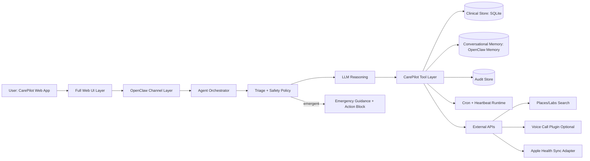
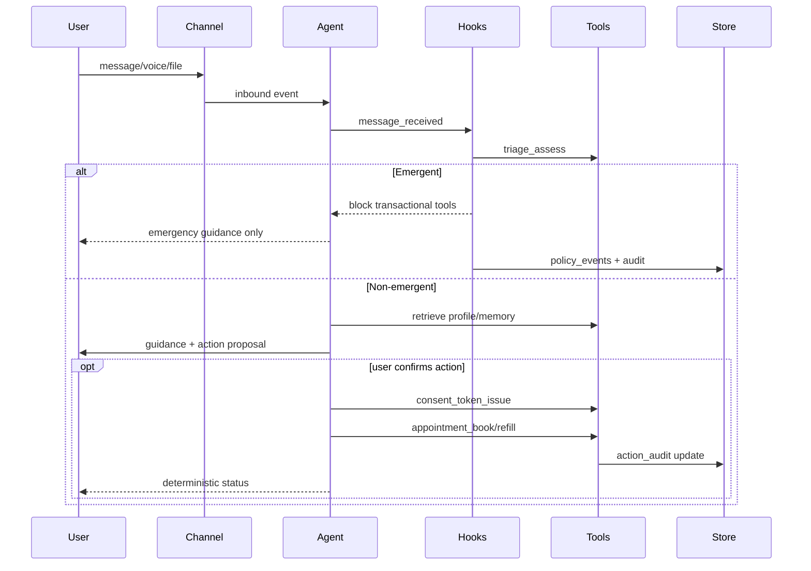

# CarePilot Technical Design Document

Version: 1.1 (defaults locked + integration boundaries)
Date: 2026-02-07
Authoring basis:
- `/Users/charleszheng/Desktop/Tartan2026/CAREPILOT_PRODUCT_DESCRIPTION.md`
- `/Users/charleszheng/Desktop/Tartan2026/doctor_agent_hackathon_strategy_and_openclaw_reuse.md`
- OpenClaw codebase at `/Users/charleszheng/Desktop/Tartan2026/app`

## 1. Goal and Scope

This document defines the full technical architecture and implementation blueprint for CarePilot on OpenClaw, with enough precision to generate an execution plan without ambiguity.

In-scope design areas:
- system architecture,
- code/module structure,
- runtime flows and state machines,
- data contracts and schemas,
- safety/consent/policy enforcement,
- external integration boundaries,
- testing and observability,
- deployment model for hackathon.

Out-of-scope:
- legal policy text finalization,
- production HIPAA compliance certification,
- broad multi-provider production contracts.

## 2. Hard Decisions Used in This Design (Locked)

To remove ambiguity, this design locks defaults now. Any changed choice only requires updates in Section 17 (decision log) and impacted modules.

1. First live action mode: `simulated booking/refill execution + real lab/clinic discovery`.
2. Triage sensitivity: `conservative` (best demo safety profile; avoids unsafe misses).
3. Primary demo persona: `adult with chronic conditions`.
4. In-network filtering: `soft preference only` for hackathon (used as ranking boost, not strict exclusion).
5. Confidence exposure: `show numeric confidence + uncertainty language`.
6. Proactive cadence: `max 1 non-urgent message/day`.
7. Profile model: `single profile` in MVP.
8. Apple Health integration mode: `simulated sync feed with production-ready API contract`.
9. Apple Health metrics in MVP: `menstrual cycle`, `medication tracking`, `workouts/activity`, `sleep`, `resting heart rate`, `step count`.
10. Voice mode: `input-only STT`.
11. Document analysis MVP: `lab report PDF/image + imaging report PDF/text`; no direct diagnostic image interpretation.
12. File retention policy: `file-type dependent retention`; extracted findings are retained for longitudinal context unless user deletes data.

## 2.1 Delivery Ownership and Boundaries

Current implementation ownership split:
- This workstream: product orchestration, clinical tools, proactive flows, UI, and integration points.
- Parallel workstream (another teammate): memory subsystem implementation and security subsystem implementation.

This document still defines the target memory/security architecture in full, and specifies integration contracts so both workstreams can merge without redesign.

## 3. System Architecture

### 3.1 High-Level Architecture



### 3.2 OpenClaw Reuse Anchors (Exact)

Core OpenClaw integration points to reuse:
- Tool orchestration and filtering:
  - `/Users/charleszheng/Desktop/Tartan2026/app/src/agents/pi-tools.ts`
  - `/Users/charleszheng/Desktop/Tartan2026/app/src/agents/pi-tools.policy.ts`
  - `/Users/charleszheng/Desktop/Tartan2026/app/src/agents/tool-policy.ts`
- Pre-tool policy enforcement hook:
  - `/Users/charleszheng/Desktop/Tartan2026/app/src/agents/pi-tools.before-tool-call.ts`
  - `/Users/charleszheng/Desktop/Tartan2026/app/src/plugins/hooks.ts`
- Proactive runtime:
  - `/Users/charleszheng/Desktop/Tartan2026/app/src/infra/heartbeat-runner.ts`
  - `/Users/charleszheng/Desktop/Tartan2026/app/src/cron/service.ts`
  - `/Users/charleszheng/Desktop/Tartan2026/app/src/agents/tools/cron-tool.ts`
- Conversational memory primitives:
  - `/Users/charleszheng/Desktop/Tartan2026/app/src/agents/tools/memory-tool.ts`
  - `/Users/charleszheng/Desktop/Tartan2026/app/src/memory/manager.ts`
  - `/Users/charleszheng/Desktop/Tartan2026/app/extensions/memory-lancedb/index.ts`
- Session routing containment:
  - `/Users/charleszheng/Desktop/Tartan2026/app/src/sessions/send-policy.ts`

### 3.3 New CarePilot Extension

Create a new plugin:
- `/Users/charleszheng/Desktop/Tartan2026/app/extensions/carepilot/openclaw.plugin.json`
- `/Users/charleszheng/Desktop/Tartan2026/app/extensions/carepilot/index.ts`
- `/Users/charleszheng/Desktop/Tartan2026/app/extensions/carepilot/config.ts`
- `/Users/charleszheng/Desktop/Tartan2026/app/extensions/carepilot/README.md`

Internal module layout:
- `tools/`:
  - `triage-assess.ts`
  - `clinical-profile-get.ts`
  - `clinical-profile-upsert.ts`
  - `care-plan-get.ts`
  - `lab-recommend.ts`
  - `appointment-book.ts`
  - `medication-refill-request.ts`
  - `health-metrics-get.ts`
  - `healthkit-sync-ingest.ts`
  - `voice-transcribe.ts`
  - `report-extract.ts`
  - `report-interpret.ts`
  - `human-escalation-create.ts`
  - `consent-token-issue.ts`
- `hooks/`:
  - `before-tool-call-consent.ts`
  - `before-agent-start-context.ts`
  - `message-received-triage.ts`
  - `message-sending-disclaimer.ts`
  - `after-tool-call-audit.ts`
- `services/`:
  - `clinical-store.ts`
  - `policy-engine.ts`
  - `idempotency.ts`
  - `refill-estimator.ts`
  - `lab-ranking.ts`
  - `health-signal-normalizer.ts`
  - `document-parser.ts`
  - `stt-service.ts`
  - `crypto.ts`
- `db/`:
  - `migrations/001_init.sql`
  - `migrations/002_temporal_memory.sql`
  - `migrations/003_documents.sql`
- `types/`:
  - `domain.ts`
  - `tool-contracts.ts`
  - `policy.ts`

## 4. Tech Stack

### 4.1 Core Runtime and Language

- Language: TypeScript (ESM) end-to-end.
- Node runtime: Node >= 22.12.
- Package manager: pnpm.
- Validation and contracts: TypeBox + Zod.
- Primary orchestration framework: OpenClaw plugin/runtime model.

### 4.2 Backend and Agent Layer

- CarePilot core backend: OpenClaw extension under `extensions/carepilot`.
- Agent orchestration and tool policy: existing OpenClaw core (`pi-tools`, tool policies, hooks).
- Scheduling and proactivity: OpenClaw heartbeat + cron service.
- Action workflows: domain tools implemented in CarePilot extension with consent/idempotency guards.

### 4.3 Frontend Web App Layer

- Web app framework: React + TypeScript (planned).
- Build tooling: Vite (planned).
- UI system: component-based UI with shared design tokens (planned).
- Transport/API: OpenClaw Gateway APIs + WebChat transport endpoints.
- Required MVP pages:
  - onboarding intake flow,
  - chat + voice input/transcript confirmation,
  - health tracking dashboard,
  - action history/audit receipts,
  - settings (permissions, proactive controls, privacy actions).

### 4.4 Data and Persistence Layer

- Clinical store: dedicated SQLite (`node:sqlite`) for structured health data.
- Conversational memory baseline: OpenClaw memory (`sqlite` + `sqlite-vec`) via memory tools.
- Audit/policy/event records: SQLite tables in same CarePilot DB file.
- Default DB location: `~/.openclaw/carepilot/carepilot.sqlite` (configurable).
- File storage: encrypted-at-rest document storage with retention policy by file category.

### 4.5 Integrations and External Services

- Lab/clinic discovery: Google Places API with mock fallback.
- Call-to-book (optional): OpenClaw Voice Call plugin (`@openclaw/voice-call`, mock provider for hackathon).
- Apple Health: simulated sync adapter now, stable DTO contract for future real sync.
- Speech-to-text: pluggable provider abstraction (OpenAI/GCP/local), default OpenAI/mock path.

### 4.6 Observability and Ops Tooling

- Structured logging with redaction pipeline.
- Metrics emission for safety/actions/proactive/memory migration health.
- Append-only action audit records for user-visible receipts.
- Safe-mode operational switch for policy anomalies/fail-closed paths.

### 4.7 Build, Test, and Delivery Tooling

- Unit/integration test framework: Vitest.
- E2E web flow testing: Playwright (planned for web app verification).
- Linting/formatting: OpenClaw repo standard linters/formatters.
- Delivery model for hackathon: single-node deployment (web app + gateway + plugin).

### 4.8 Memory and Security Integration Plan (Parallel Team Ownership)

Memory plan:
- Use the currently planned memory stack now (`memory-lancedb` + existing OpenClaw memory tooling + clinical profile contracts).
- A parallel teammate is building the next-generation memory system.
- When that system is ready, we will update and migrate memory without changing product behavior.

Security core implementation remains owned by a parallel teammate. This workstream integrates through strict contracts:

- Memory integration contract:
  - `clinical_profile_get` and `clinical_profile_upsert` remain the sole clinical read/write APIs from this workstream.
  - current baseline memory uses existing OpenClaw memory slot + tools.
  - next-generation memory will plug retrieval and decay internals behind the same APIs and memory slot boundary.
  - this workstream consumes only stable fields: `status`, `confidence`, `last_confirmed_at`, `expires_at`, `source`.
- Security integration contract:
  - this workstream emits deterministic policy checkpoints (`before_tool_call` validation points, audit events, token lifecycle events).
  - parallel security team implements and hardens cryptography, redaction, and policy anomaly handling internals.
  - this workstream depends only on stable interfaces: `validateConsentToken`, `redactForLog`, `emitPolicyEvent`, `setSafeMode`.

Merge criteria across workstreams:
- no direct cross-module DB writes outside contract services,
- shared schema migration IDs agreed before merge,
- integration tests must pass for consent gating, action audit, and stale-memory handling.

Rollout toggle plan:
- current default: `plugins.slots.memory = "memory-lancedb"`.
- migration target: switch slot/backend wiring to teammate-provided memory system while preserving tool contracts.

Memory migration plan (when new memory system is complete):
0. Phase 0 (backfill): copy historical baseline memory into new memory system and mark imported records with source=`migration_backfill` + original ids.
1. Phase 1 (prepare): keep current reads from baseline memory, add dual-write from memory update paths to baseline + new system.
2. Phase 2 (verify): run parity checks on recall quality, stale-state handling, and safety filters across both systems.
3. Phase 3 (cutover): switch read path to new memory system behind the same APIs.
4. Phase 4 (decommission): stop dual-write and archive baseline memory index after validation window.

Dual-write semantics (required):
- `create/update`: write to baseline and new system in the same request envelope; record both write results.
- `delete/forget`: write tombstone to both systems; hard-delete is deferred until tombstone propagation is confirmed.
- `resolve/expire` state transitions: propagate state + timestamps to both systems.
- if one side fails:
  - request is marked partial,
  - retry job is queued with exponential backoff,
  - user-facing behavior follows source-of-truth store and does not overclaim write completion.

Schema/version compatibility contract:
- every memory record carries `schema_version`.
- migration adapters must support `N` and `N-1` versions during cutover window.
- breaking schema changes require new adapter version and replay test set before deployment.
- if a backend cannot store `schema_version` natively, use adapter-managed side metadata keyed by memory id.

Cutover acceptance criteria (must all pass):
- recall parity: top-5 overlap >= 90% on benchmark query set (minimum 500 sampled queries).
- stale-state parity: classification agreement >= 99% on temporal memory fixtures (minimum 200 fixtures).
- safety parity: high-risk memory-blocking checks must match 100% on safety test suite (minimum 200 cases).
- performance parity: p95 recall latency regression <= 20% from baseline.
- write reliability: dual-write success rate >= 99.5% over 7-day validation window.

Rollback plan (required):
- rollback triggers:
  - any cutover acceptance criterion violation after switch,
  - safety parity drop below 100% on high-risk suite,
  - sustained write reliability below 99.0% for 30 minutes.
- rollback steps:
  1. flip read path back to baseline memory slot,
  2. keep dual-write enabled for data continuity,
  3. open incident and capture diff snapshot,
  4. rerun parity suite before attempting recutover.

Validation/decommission timing:
- minimum post-cutover validation window before decommission: 14 days.

## 5. Data Model and Schema

### 5.1 Core Tables

Every table in this section MUST physically include:
- `created_at TEXT NOT NULL DEFAULT CURRENT_TIMESTAMP`
- `updated_at TEXT NOT NULL DEFAULT CURRENT_TIMESTAMP`

Migration requirement:
- add an `updated_at` trigger per table so updates always refresh `updated_at`.

`user_id` is required for user-scoped entities and nullable only for global/system policy events.

1. `patient_profile`
- `id TEXT PRIMARY KEY`
- `user_id TEXT UNIQUE NOT NULL`
- `timezone TEXT NOT NULL`
- `locale TEXT DEFAULT 'en-US'`
- `date_of_birth_year INTEGER NULL`
- `biological_sex TEXT NULL`
- `proactive_mode TEXT NOT NULL DEFAULT 'active'` (`active|paused|medication_only`)
- `snooze_until TEXT NULL`
- `quiet_hours_start TEXT NOT NULL DEFAULT '22:00'`
- `quiet_hours_end TEXT NOT NULL DEFAULT '08:00'`

2. `conditions`
- `id TEXT PRIMARY KEY`
- `user_id TEXT NOT NULL`
- `name TEXT NOT NULL`
- `status TEXT NOT NULL` (`active|resolved|unknown`)
- `severity TEXT NULL`
- `diagnosed_date TEXT NULL`
- `source TEXT NOT NULL` (`user_direct|tool_result|model_inference`)
- `confidence REAL NOT NULL`

3. `allergies`
- `id TEXT PRIMARY KEY`
- `user_id TEXT NOT NULL`
- `substance TEXT NOT NULL`
- `reaction TEXT NULL`
- `severity TEXT NULL`
- `status TEXT NOT NULL DEFAULT 'active'`

4. `medications`
- `id TEXT PRIMARY KEY`
- `user_id TEXT NOT NULL`
- `name TEXT NOT NULL`
- `dose_value REAL NULL`
- `dose_unit TEXT NULL`
- `frequency_per_day REAL NOT NULL`
- `quantity_dispensed REAL NULL`
- `last_fill_date TEXT NULL`
- `pharmacy_name TEXT NULL`
- `pharmacy_contact TEXT NULL`
- `status TEXT NOT NULL DEFAULT 'active'`

5. `symptom_states`
- `id TEXT PRIMARY KEY`
- `user_id TEXT NOT NULL`
- `symptom TEXT NOT NULL`
- `status TEXT NOT NULL` (`active|resolved|resolved_unconfirmed|unknown`)
- `severity TEXT NULL`
- `onset_at TEXT NULL`
- `last_confirmed_at TEXT NULL`
- `expires_at TEXT NULL`
- `retention_class TEXT NOT NULL DEFAULT 'TIME_BOUND_STATE'`

6. `appointments`
- `id TEXT PRIMARY KEY`
- `user_id TEXT NOT NULL`
- `provider_name TEXT NOT NULL`
- `location TEXT NOT NULL`
- `starts_at TEXT NOT NULL`
- `status TEXT NOT NULL` (`planned|awaiting_confirmation|executing|succeeded|failed|partial|blocked|expired|pending`)
- `external_ref TEXT NULL`

7. `action_audit`
- `id TEXT PRIMARY KEY`
- `user_id TEXT NOT NULL`
- `action_type TEXT NOT NULL`
- `payload_hash TEXT NOT NULL`
- `idempotency_key TEXT NOT NULL`
- `consent_token TEXT NULL`
- `status TEXT NOT NULL`
- `error_code TEXT NULL`
- `error_message TEXT NULL`
- `consent_snapshot_json TEXT NULL`
- `replay_window_bucket TEXT NOT NULL`
- `started_at TEXT NOT NULL`
- `finished_at TEXT NULL`
- unique index on `(user_id, idempotency_key, replay_window_bucket)`

8. `consent_tokens`
- `token TEXT PRIMARY KEY`
- `user_id TEXT NOT NULL`
- `action_type TEXT NOT NULL`
- `payload_hash TEXT NOT NULL`
- `issued_at TEXT NOT NULL`
- `expires_at TEXT NOT NULL`
- `used_at TEXT NULL`

9. `health_signals`
- `id TEXT PRIMARY KEY`
- `user_id TEXT NOT NULL`
- `metric_type TEXT NOT NULL` (`cycle|medication_tracking|workouts|sleep|resting_hr|step_count`)
- `source TEXT NOT NULL` (`apple_health|user_reported|tool_result`)
- `summary_json TEXT NOT NULL`
- `observed_at TEXT NOT NULL`
- `synced_at TEXT NOT NULL`
- `stale_after TEXT NOT NULL`

10. `health_connections`
- `id TEXT PRIMARY KEY`
- `user_id TEXT NOT NULL`
- `source_type TEXT NOT NULL` (`apple_health`)
- `connection_status TEXT NOT NULL` (`connected|disconnected|error`)
- `last_sync_at TEXT NULL`
- `permissions_json TEXT NOT NULL`
- `connection_meta_json TEXT NULL`

11. `documents`
- `id TEXT PRIMARY KEY`
- `user_id TEXT NOT NULL`
- `file_name TEXT NOT NULL`
- `mime_type TEXT NOT NULL`
- `file_category TEXT NOT NULL` (`lab_report|imaging_report|clinical_note|voice_attachment|other`)
- `encrypted_path TEXT NOT NULL`
- `upload_time TEXT NOT NULL`
- `retention_until TEXT NOT NULL`
- `retention_policy_key TEXT NOT NULL`
- `is_context_eligible INTEGER NOT NULL DEFAULT 1`
- `processing_status TEXT NOT NULL` (`queued|processed|failed|deleted`)

12. `extracted_findings`
- `id TEXT PRIMARY KEY`
- `document_id TEXT NOT NULL`
- `user_id TEXT NOT NULL`
- `finding_type TEXT NOT NULL`
- `label TEXT NOT NULL`
- `value_text TEXT NULL`
- `unit TEXT NULL`
- `reference_range TEXT NULL`
- `is_abnormal INTEGER NOT NULL DEFAULT 0`
- `confidence REAL NOT NULL`
- `provenance_json TEXT NOT NULL`

13. `policy_events`
- `id TEXT PRIMARY KEY`
- `user_id TEXT NULL`
- `event_type TEXT NOT NULL`
- `tool_name TEXT NULL`
- `details_json TEXT NOT NULL`
- `created_at TEXT NOT NULL`

### 5.2 Encryption and Sensitive Fields

Sensitive columns (`summary_json`, `value_text`, `encrypted_path`, selected profile fields) will use field-level encryption using AES-256-GCM with a key from `CAREPILOT_MASTER_KEY`.

- key format: base64 32-byte key.
- encrypted payload format: `base64(iv || ciphertext || auth_tag)`.
- decryption only within tool execution path; never logged.

Ownership note:
- cryptographic implementation and key-management hardening are owned by the parallel security workstream.
- this workstream integrates via the `crypto.ts` interface and does not bypass it.

### 5.3 Temporal Memory Rules

- `LONG_LIVED_FACT`: no expiration by default.
- `TIME_BOUND_STATE`: requires `expires_at`, `last_confirmed_at`.
- `EVENT`: immutable historical record.
- `INFERENCE`: max TTL 24h, never source-of-truth.

Operational cadence (locked):
- default symptom reconfirmation prompt: 48 hours after initial `TIME_BOUND_STATE(active)` write.
- auto-transition to `resolved_unconfirmed`: 7 days after last confirmation if no response.
- after transition to `resolved_unconfirmed`, symptoms are history-only and never treated as current without reconfirmation.
- Apple Health trend summaries are treated as weekly states with automatic decay every 7 days unless refreshed.

### 5.4 File-Type Retention and Longitudinal Context Policy

Retention is file-type dependent:
- `lab_report`: retain raw file 24 months.
- `imaging_report`: retain raw file 24 months.
- `clinical_note`: retain raw file 12 months.
- `voice_attachment`: retain raw file 30 days.
- `other`: retain raw file 90 days.

Context persistence behavior:
- extracted structured findings are retained beyond raw file expiration for longitudinal recommendation context.
- raw file expiration does not delete derived findings unless user requests full data deletion.
- every derived finding keeps provenance back to original `document_id` and extraction metadata.

### 5.5 Query Optimization and Index Plan

Required indexes:
- `idx_conditions_user_status` on `conditions(user_id, status)`
- `idx_medications_user_status` on `medications(user_id, status)`
- `idx_symptom_states_user_status` on `symptom_states(user_id, status)`
- `idx_appointments_user_starts` on `appointments(user_id, starts_at)`
- `idx_action_audit_user_started` on `action_audit(user_id, started_at)`
- `idx_health_signals_user_metric_time` on `health_signals(user_id, metric_type, observed_at)`
- `idx_documents_user_category_upload` on `documents(user_id, file_category, upload_time)`
- `idx_findings_user_label` on `extracted_findings(user_id, label)`

## 6. Tool Contracts (Exact Behavior)

Each tool is JSON-schema validated and returns structured JSON object with `status`, `data`, `errors`.

### 6.1 `triage_assess`

Input:
- `message_text: string`
- `user_context?: object`

Output:
- `triage_level: EMERGENT|URGENT_24H|ROUTINE`
- `signals: string[]`
- `recommended_next_step: string`
- `confidence: number` (0.00-1.00, user-visible)
- `confidence_label: high|medium|low`

Rules:
- If emergent triggers hit threshold, set `EMERGENT` and include `action_block=true` in metadata.

### 6.2 `clinical_profile_get`

Input:
- `sections?: string[]` (conditions, allergies, medications, preferences, active_symptoms)

Output:
- normalized structured profile subset
- `source_of_truth: 'clinical_store'`

### 6.3 `clinical_profile_upsert`

Input:
- `entity_type`
- `operation` (`create|update|resolve|delete_soft`)
- `payload`
- `source`

Output:
- updated entity
- `write_guard_result`

Write guard checks:
- required confidence + source,
- TTL for non-long-lived facts,
- reconfirmation flags for impactful clinical changes.

### 6.4 `lab_recommend`

Definition:
- in-network means the facility/provider is expected to be covered by the user's insurance network.

Input:
- `zip_or_geo`
- `max_distance_miles`
- `budget_cap`
- `preferred_time_window`
- `in_network_preference?` (`prefer_in_network|no_preference`)

Output:
- `options[]` with fields: name, distance, price_range, next_slot, rating, rank_score, rank_reason, network_match_hint

Ranking function (normalized 0-1 lower-is-better where relevant):
- `score = 0.35*distance + 0.25*price + 0.25*next_slot_wait + 0.10*(1-rating_norm) + 0.05*network_penalty`

Hackathon behavior:
- in-network is a soft ranking preference only (no hard filtering/exclusion).
- if payer-network data is unavailable, response must clearly label network as unknown.

### 6.5 `appointment_book`

Input:
- `provider_id`
- `slot_datetime`
- `location`
- `mode` (`simulated|real_api|call_to_book`)
- `consent_token`
- `idempotency_key`

Output:
- lifecycle transition event,
- status (`executing|succeeded|failed|pending`),
- confirmation artifact (`external_ref|sim_ref`).

### 6.6 `medication_refill_request`

Input:
- `medication_id`
- `pharmacy_target`
- `remaining_pills_reported?`
- `consent_token`
- `idempotency_key`

Output:
- run-out estimate,
- request execution status,
- recommended follow-up date.

### 6.7 `healthkit_sync_ingest`

Input:
- `source_session_id`
- `signals[]` normalized by metric type

Output:
- counts by metric type,
- stale markers,
- sync summary.

### 6.8 `health_metrics_get`

Input:
- `metric_types[]`
- `lookback_days`

Output:
- dashboard-ready cards:
  - connected source status (for example Apple Health connected/disconnected/error),
  - enabled status,
  - latest value summary,
  - last sync,
  - stale flag,
  - active symptom-state summary from clinical store,
  - per-metric permission toggles and data controls metadata.

### 6.9 `voice_transcribe`

Input:
- `audio_uri`
- `language_hint`

Output:
- `transcript_text`
- `confidence`
- `segments[]`

Policy:
- transcript becomes canonical input for triage and memory, not raw audio text snippets.

### 6.10 `report_extract` and `report_interpret`

`report_extract` output:
- structured findings with provenance and confidence.

`report_interpret` output:
- plain-language summary,
- abnormal highlights,
- suggested clinician questions,
- urgency guidance if risk markers exist.

### 6.11 `consent_token_issue`

Input:
- `action_type`
- `payload_hash`
- `expires_in_seconds` (default 300)

Output:
- signed token record persisted in `consent_tokens`.

### 6.12 `human_escalation_create`

Input:
- reason,
- latest triage,
- summary payload.

Output:
- escalation ticket id + packet preview.

### 6.13 Memory Tool Routing Policy (Required)

Read routing precedence:
1. `clinical_profile_get` for clinical facts and safety-critical fields.
2. `memory_recall` for preference/conversational context only.
3. `memory_search`/`memory_get` for document-style lookup and citation retrieval.

Write routing precedence:
1. `clinical_profile_upsert` for all clinical-state writes.
2. `memory_store` for preference and conversational habit writes.

Conflict resolution:
- if conversational memory conflicts with clinical store, clinical store wins.
- response language must acknowledge uncertainty and request reconfirmation instead of silently overwriting.

Migration read modes:
- `baseline_only`: only baseline memory serves reads.
- `shadow_compare`: baseline serves responses, new memory queried in shadow for parity telemetry.
- `new_primary`: new memory serves reads, baseline kept for rollback window.

## 7. Runtime Flow Definitions

### 7.1 Inbound Message Flow



### 7.2 Action Lifecycle State Machine

State transitions (enforced in service layer):
- `planned -> awaiting_confirmation`
- `awaiting_confirmation -> executing` only with valid consent token
- `executing -> succeeded|failed|partial|blocked|expired|pending`
- no direct `planned -> succeeded`

Validation rules:
- transition guard checks,
- timestamp monotonicity,
- mandatory audit write on each transition.

### 7.3 Triage Pipeline

1. Pre-normalize input.
2. Pattern/rule pass for hard emergency triggers.
3. LLM-assisted classification with strict label set.
4. Conflict resolver: emergency rule beats model uncertainty.
5. Output triage label + explanation + recommended path.

Emergency hard triggers include:
- chest pain with breathing difficulty,
- stroke-like symptoms,
- severe bleeding,
- anaphylaxis indicators,
- active self-harm intent,
- overdose language.

### 7.4 Refill Predictor Algorithm

Inputs:
- `last_fill_date`,
- `quantity_dispensed`,
- `frequency_per_day`,
- `missed_doses_estimate`,
- optional user-reported remaining pills.

Computation:
- `effective_daily_use = max(0.1, frequency_per_day - missed_dose_adjustment)`
- `estimated_days_total = quantity_dispensed / effective_daily_use`
- `estimated_runout_date = last_fill_date + estimated_days_total`
- confidence bands:
  - high: all fields present,
  - medium: one inferred field,
  - low: >=2 inferred fields.

Behavior:
- if confidence low, prompt user for remaining pills before action proposal.

Edge-case handling (required):
- `PRN/as-needed` medications:
  - do not auto-compute run-out from fixed daily frequency.
  - prompt user for current remaining quantity and recent usage pattern before any refill suggestion.
- non-daily regimens (weekly, biweekly, monthly):
  - compute using schedule interval instead of `frequency_per_day`.
- tapering regimens:
  - require schedule segments (`start_date`, `dose`, `duration_days`) and compute segment-wise consumption.
- paused/held medications:
  - suspend refill reminders while `status=paused`.
- missing `quantity_dispensed` or `last_fill_date`:
  - force user confirmation path; no autonomous run-out claim.

### 7.5 Proactive Engine

Use both OpenClaw heartbeat and cron:
- heartbeat for periodic global check,
- cron for deterministic reminders and follow-ups.

Enforcement:
- quiet hours from profile,
- max non-urgent send count/day,
- user mode flags (`paused`, `snooze_until`, `medication_only`).

Control intent mapping:
- `pause proactive care` -> `proactive_mode = paused`
- `resume proactive care` -> `proactive_mode = active` and clear `snooze_until`
- `snooze for X days` -> set `snooze_until`
- `only medication reminders` -> `proactive_mode = medication_only`

Implementation detail:
- heartbeat is configured through `agentDefaults.heartbeat`.
- cron jobs are created with `sessionTarget='main'` and `payload.kind='systemEvent'` for user-facing reminders.

Scheduling edge-case rules:
- all reminder scheduling is computed in user timezone, then persisted as UTC timestamps.
- DST transitions:
  - if scheduled local time does not exist (spring forward), run at next valid local minute.
  - if scheduled local time repeats (fall back), execute once using first occurrence and dedupe by job id + local date key.

## 8. OpenClaw Hook Integration

### 8.1 `message_received` Hook

Module: `hooks/message-received-triage.ts`

Actions:
- run `triage_assess` first,
- persist triage event,
- if emergent: inject emergency-only response directive and set tool block context for this turn.

### 8.2 `before_tool_call` Hook

Module: `hooks/before-tool-call-consent.ts`

Checks:
- if tool in transactional set (`appointment_book`, `medication_refill_request`, `human_escalation_create` where needed), verify:
  - valid unexpired consent token,
  - payload hash match,
  - token not already used,
  - non-emergent context.

On failure:
- block call,
- emit policy event,
- return user-safe explanation.

### 8.3 `before_agent_start` Hook

Module: `hooks/before-agent-start-context.ts`

Injects:
- condensed confirmed clinical profile,
- currently active symptom states only,
- recent actionable events,
- reminder preferences.

### 8.4 `message_sending` Hook

Module: `hooks/message-sending-disclaimer.ts`

Adds disclaimer if session has not received one in current thread.

### 8.5 `after_tool_call` Hook

Module: `hooks/after-tool-call-audit.ts`

Responsibilities:
- persist tool outcome summary,
- enforce “no overclaim” language normalization,
- trigger follow-up scheduling when needed.

## 9. Consent, Idempotency, and Safety Controls (Integration Contracts)

Implementation ownership note:
- control points and APIs are specified here for immediate integration.
- hardening internals (crypto/redaction/policy anomaly engine) are owned by the parallel security workstream.

### 9.1 Consent Contract

Transactional action requires:
- explicit confirmation utterance,
- issued token (TTL 5 minutes default),
- exact payload hash match.

Token lifecycle:
- issue -> persist -> consume once -> mark used.

### 9.2 Idempotency

Idempotency key format:
- `sha256(user_id + action_type + canonical_payload + target_ref)`.

Where:
- `target_ref` is the concrete target of the action (for example appointment slot id or pharmacy request target).

Behavior:
- duplicate key with terminal success returns prior result,
- duplicate key while in-progress returns `pending`.
- legitimate retry is allowed by changing `request_nonce` (explicit user re-confirmation required).
- idempotency replay protection window defaults to 24 hours via `replay_window_bucket`; outside that bucket, identical payloads are treated as new requests.

### 9.3 Safe Mode

If policy anomalies exceed threshold:
- toggle safe mode in plugin runtime,
- disable transactional tools,
- keep read-only guidance active,
- notify user of temporary limitation,
- emit policy event.

### 9.4 Fail-Closed Policy Availability Rule

If policy/consent validation dependencies are unavailable at runtime:
- block all transactional tool calls immediately,
- return user-safe fallback response,
- emit `policy_unavailable_fail_closed` event in `policy_events`,
- keep triage and read-only guidance available.

### 9.5 Privacy Controls (MVP)

MVP includes privacy controls through the web app settings UI (not chat command syntax):
- `Export my data` action:
  - generates a user-scoped export package (profile, actions, findings, signals metadata).
- `Delete my data` action:
  - hard-deletes user-scoped records and encrypted files, preserving minimal non-identifiable audit tombstones.

Both actions require explicit confirmation and are logged in `action_audit`.

### 9.6 Data Leakage and Abuse Prevention Rules

Required policy rules:
- block broad “dump all memory/profile” responses by default.
- enforce strict `user_id` + `session_key` scoping on every clinical and memory read.
- reject cross-user identifiers even if explicitly requested in prompt content.
- sanitize tool outputs before model exposure when payloads contain protected identifiers.

## 10. Apple Health Integration Design

### 10.1 Adapter Model

Hackathon mode uses simulated feed:
- endpoint (internal tool input) accepts normalized payloads with source timestamp,
- ingestion service validates schema and writes summarized signals.

Production-ready contract (stable):
- `metric_type`,
- `observed_at`,
- `value/raw summary`,
- `source_device`,
- permission scope id.

### 10.2 Permission Model

Per metric toggle stored in profile config:
- cycle,
- medication tracking,
- workouts,
- sleep,
- resting heart rate,
- step count.

Revocation behavior:
- stop ingestion for metric immediately,
- hide metric from recommendation grounding,
- preserve or delete historical data based on user choice.

### 10.3 Grounding Rule in Responses

When health signals are used in advice, response must mention source and recency.

Example style:
- “Using your workout trend synced from Apple Health in the last 7 days...”

## 11. Voice and Document Analysis

### 11.1 Voice Input Pipeline

1. user uploads audio.
2. `voice_transcribe` returns transcript.
3. UI shows editable transcript preview.
4. transcript sent as canonical text.
5. triage + normal pipeline runs.

### 11.2 Document Pipeline

MVP scope lock:
- lab reports (PDF/image) and imaging reports (PDF/text export) only.
- direct diagnostic interpretation from raw medical images is out of scope.

1. upload file and create `documents` row.
2. encrypted storage write.
3. `report_extract` parses structured findings.
4. `report_interpret` produces plain summary + questions.
5. extracted findings persisted with provenance.
6. uncertain findings flagged for reconfirmation.

Safety constraints:
- no definitive diagnostic claims.
- high-risk findings trigger urgent follow-up recommendation text.

### 11.3 Prior-Result Trend Comparison (Required)

For lab report interpretation, the system must compare new findings to prior findings when available:
- matching key: `user_id + normalized_test_name + unit`.
- comparison window default: last 24 months.
- output fields per finding:
  - `prior_value`,
  - `delta_absolute`,
  - `delta_percent`,
  - `trend_direction` (`up|down|stable`),
  - `clinical_significance_hint` (language-only, non-diagnostic).

If no comparable prior result exists:
- explicitly state “no prior comparable result available”.

## 12. Configuration Blueprint

### 12.1 Plugin Manifest (Skeleton)

`openclaw.plugin.json`:
- `id: "carepilot"`
- `kind: "extension"`
- `configSchema`: includes DB path, encryption key source, API providers, feature toggles.
- expose tools listed in Section 6.

### 12.2 OpenClaw Config Snippet

```json5
{
  plugins: {
    entries: {
      carepilot: {
        enabled: true,
        config: {
          dbPath: "~/.openclaw/carepilot/carepilot.sqlite",
          retentionPolicies: {
            lab_report_days: 730,
            imaging_report_days: 730,
            clinical_note_days: 365,
            voice_attachment_days: 30,
            other_days: 90
          },
          triageMode: "conservative",
          actionMode: "simulated",
          proactiveMaxPerDay: 1,
          voice: { provider: "openai", enabled: true },
          docs: { imagingAssist: true, directImagingInterpretation: false },
          healthkit: {
            mode: "simulated",
            enabledMetrics: ["cycle", "medication_tracking", "workouts", "sleep", "resting_hr", "step_count"]
          }
        }
      }
    },
    slots: {
      // Current baseline memory stack.
      memory: "memory-lancedb"
    }
  },
  agents: {
    list: [
      {
        id: "carepilot-main",
        tools: {
          allow: [
            "group:plugins",
            "memory_recall",
            "memory_store",
            "memory_search",
            "memory_get",
            "cron"
          ]
        }
      }
    ]
  }
}
```

### 12.3 Heartbeat and Cron Defaults

```json5
{
  agentDefaults: {
    heartbeat: {
      every: "12h",
      activeHours: { start: "08:00", end: "22:00", timezone: "user" },
      session: "main",
      target: "last",
      prompt: "Evaluate pending CarePilot reminders and unresolved actions. Send only if actionable and policy allows."
    }
  }
}
```

Cron reminder policy:
- `appointment reminder`: 24h and 2h before start.
- `refill reminder`: at run-out minus 5 days, minus 2 days, minus 1 day (respect caps).
- follow-up reminder: 3 days after suggested lab if unresolved.

## 13. Observability and Auditing

### 13.1 Logging

Structured logs for:
- tool invocations,
- policy blocks,
- triage labels,
- consent issuance/usage,
- reminder sends/skips.

Redaction rules:
- strip direct identifiers, phone, full DOB, raw lab document text from logs.

### 13.2 Metrics

Expose counters/gauges:
- `carepilot_triage_total{level}`
- `carepilot_action_total{type,status}`
- `carepilot_policy_block_total{reason}`
- `carepilot_proactive_sent_total`
- `carepilot_proactive_suppressed_total{reason}`
- `carepilot_doc_parse_fail_total`
- `carepilot_memory_dual_write_total{result}`
- `carepilot_memory_parity_mismatch_total{type}`
- `carepilot_memory_cutover_mode{mode}`
- `carepilot_memory_recall_latency_ms{backend}`

### 13.3 Audit UI Payload

Each action receipt includes:
- action id,
- user confirmation text snapshot,
- payload summary,
- lifecycle timeline,
- final status and evidence artifact.

## 14. Testing Strategy

### 14.1 Unit Tests

Add tests under:
- `/Users/charleszheng/Desktop/Tartan2026/app/extensions/carepilot/**/*.test.ts`

Critical unit suites:
- triage classification edge cases,
- consent token validation/expiry/replay,
- idempotency duplicates,
- refill estimator confidence and date math,
- ranking model deterministic output,
- temporal symptom decay transitions,
- memory record schema-version adapter compatibility.

### 14.2 Integration Tests

Use OpenClaw tool invocation harness to test:
- hook + tool call chain,
- emergency lockout,
- transaction action with/without consent,
- reminder suppression by quiet hours and caps,
- document flow end-to-end,
- memory routing precedence (`clinical_profile_get` over conversational memory),
- dual-write create/update/delete/tombstone propagation.

### 14.3 E2E Demo Tests

Scripted scenario tests:
1. fatigue -> lab recommendation -> book simulated -> audit success.
2. missed doses -> proactive refill -> confirmation -> execution state transition.
3. emergency phrase -> immediate emergency guidance -> action block.
4. document upload -> extraction summary -> follow-up questions.
5. web dashboard renders Apple Health cards + sync recency + permission toggles.
6. voice transcript preview/edit flow before send.
7. memory migration shadow mode parity run produces no blocker mismatches.
8. cutover rollback drill restores baseline reads without data loss.

## 15. Deployment and Operations (Hackathon)

### 15.1 Local Run

1. install deps: `pnpm install` in `/Users/charleszheng/Desktop/Tartan2026/app`.
2. enable plugin in config.
3. run gateway dev mode.
4. run CarePilot web UI (full app surface) against the gateway APIs.
5. use WebChat transport endpoints under the hood for chat delivery.

### 15.2 Demo Data Strategy

Use synthetic patient profiles only.

Seed scripts:
- create one chronic-condition persona,
- include medication history, allergies, prior labs,
- pre-seed one unresolved care task for proactive demo.

### 15.3 Failure Modes and Fallbacks

- external search API unavailable: return cached/simulated options with explicit label.
- transcription unavailable: fallback to typed entry prompt.
- document parser fails: return safe summary + manual upload retry guidance.
- policy service issue: safe mode auto-enabled.

## 16. Implementation-Ready Work Breakdown

This section maps features to concrete module ownership.

1. Plugin scaffold + config schema
- files: `extensions/carepilot/openclaw.plugin.json`, `index.ts`, `config.ts`

2. Clinical store + migrations
- files: `services/clinical-store.ts`, `db/migrations/*.sql`

3. Triage + safety hooks
- files: `tools/triage-assess.ts`, `hooks/message-received-triage.ts`, `services/policy-engine.ts`

4. Consent + idempotency
- files: `tools/consent-token-issue.ts`, `hooks/before-tool-call-consent.ts`, `services/idempotency.ts`

5. Action tools (booking/refill/labs)
- files: `tools/lab-recommend.ts`, `tools/appointment-book.ts`, `tools/medication-refill-request.ts`, `services/lab-ranking.ts`, `services/refill-estimator.ts`

6. Proactive runtime integration
- files: `services/proactive-scheduler.ts`, cron job creation wrappers, heartbeat prompt config wiring

7. Health signals
- files: `tools/healthkit-sync-ingest.ts`, `tools/health-metrics-get.ts`, `services/health-signal-normalizer.ts`

8. Voice + document
- files: `tools/voice-transcribe.ts`, `tools/report-extract.ts`, `tools/report-interpret.ts`, `services/stt-service.ts`, `services/document-parser.ts`

9. Audit + observability
- files: `hooks/after-tool-call-audit.ts`, `services/audit-writer.ts`, metrics emitter module

10. Full web app UI surface
- pages/components:
  - onboarding intake wizard,
  - chat + mic capture + transcript confirm,
  - health dashboard cards + connected sources panel,
  - action receipts timeline,
  - settings/permissions/proactive controls.

11. Memory integration (owned by parallel memory workstream; integrated here)
- this workstream deliverables:
  - use baseline planned memory stack now (`memory-lancedb` + existing memory tools),
  - consume contract fields from memory APIs,
  - wire memory calls into care flows,
  - pass integration tests.
- parallel memory workstream deliverables:
  - next-generation retrieval ranking, decay jobs, reconfirmation internals.
  - migration support artifacts (dual-write adapter + parity report).

13. Memory migration execution (joint runbook)
- phase checkpoints:
  - backfill complete,
  - dual-write stability window passed,
  - parity thresholds passed,
  - cutover approved,
  - rollback drill passed before decommission.

12. Security integration (owned by parallel security workstream; integrated here)
- this workstream deliverables:
  - checkpoint hooks, deterministic action state machine, audit event emission.
- parallel security workstream deliverables:
  - encryption hardening, redaction internals, safe-mode control-plane behavior.

## 17. Decision Log (Resolved)

Locked decisions based on product direction:

1. Action execution mode: simulated execution + real discovery.
2. Triage mode: conservative.
3. Persona: single adult chronic-condition user.
4. In-network behavior: soft preference only (not hard filter) in hackathon.
5. Confidence display: numeric score plus uncertainty language.
6. Proactive cap: 1 non-urgent proactive message/day.
7. Profile scope: no family profile in MVP.
8. Apple Health: simulated sync in hackathon.
9. Apple Health metrics: cycle, medication tracking, workouts, sleep, resting heart rate, step count.
10. Voice: STT input-only.
11. Document scope: lab + imaging reports.
12. Retention: file-type dependent; structured extracted findings retained for future context.
13. Product surface: full web app UI.
14. Privacy controls: include export/delete via settings UI actions (not chat commands).
15. Memory strategy: use current planned memory stack now, then migrate to teammate-provided new memory system with phased cutover.
